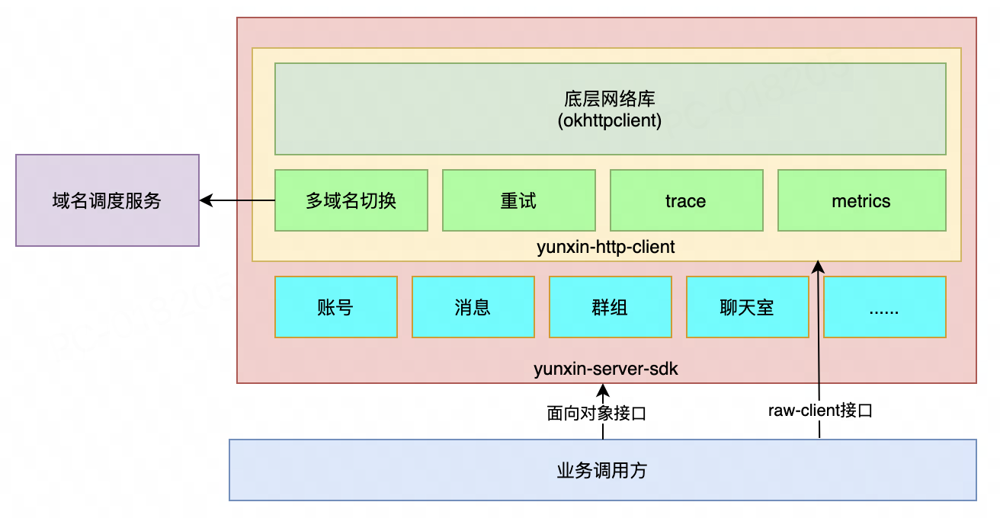

# 云信im-server-sdk

## 核心特性

* 基于okhttp封装了云信服务器api的sdk
* 支持重试，支持配置不同的重试策略，也支持自定义重试策略
* 支持多域名高可用，故障自动切换
* 支持trace-id，方便问题排查
* 支持metrics，支持prometheus格式输出
* 支持使用raw-client直接发起请求，也支持使用面向对象的client发起请求
* 支持云信的v1-api，也支持v2-api
* 支持云信私有化环境使用

## 架构图



## 快速开始（v1接口，使用raw-client）

```java
import com.alibaba.fastjson2.JSONObject;
import com.netease.nim.im.server.sdk.core.exception.YunxinSdkException;
import com.netease.nim.im.server.sdk.core.YunxinApiHttpClient;
import com.netease.nim.im.server.sdk.core.YunxinApiResponse;

import java.util.HashMap;
import java.util.Map;

/**
 * Created by caojiajun on 2024/12/10
 */
public class Test {

    public static void main(String[] args) {
        // 初始化
        String appkey = "xx";
        String appsecret = "xx";
        int timeoutMillis = 5000;
        //
        YunxinApiHttpClient client = new YunxinApiHttpClient.Builder(appkey, appsecret)
                .timeoutMillis(timeoutMillis)
                .build();

        // 请求地址
        String path = "/user/create.action";

        // 请求参数
        Map<String, String> paramMap = new HashMap<>();
        paramMap.put("accid", "zhangsan");

        // 执行请求
        YunxinApiResponse response;
        try {
            response = client.executeV1Api(path, paramMap);
        } catch (YunxinSdkException e) {//这是一个RuntimeException
            // 请求失败
            System.err.println("register error, traceId = " + e.getTraceId());
            return;
        }

        // 获取结果
        String data = response.getData();
        // 解析结果
        JSONObject json = JSONObject.parseObject(data);
        int code = json.getIntValue("code");
        if (code != 200) {
            // 注册失败
            System.err.println("register fail, response = " + data + ", traceId=" + response.getTraceId());
        } else {
            // 注册成功
            JSONObject info = json.getJSONObject("info");
            String accid = info.getString("accid");
            String token = info.getString("token");
            System.out.println("register success, accid = " + accid + ", token = " + token + ", traceId=" + response.getTraceId());
        }
    }
}


```

## 快速开始（v1接口，使用面向对象client）

```java

import com.netease.nim.im.server.sdk.core.exception.YunxinSdkException;
import com.netease.nim.im.server.sdk.core.YunxinApiHttpClient;
import com.netease.nim.im.server.sdk.core.Result;
import com.netease.nim.im.server.sdk.v1.YunxinV1ApiServices;
import com.netease.nim.im.server.sdk.v1.account.request.CreateAccountRequestV1;
import com.netease.nim.im.server.sdk.v1.account.response.CreateAccountResponseV1;

/**
 * Created by caojiajun on 2024/12/11
 */
public class Test6 {

    public static void main(String[] args) {
        // 初始化
        String appkey = "xx";
        String appsecret = "xx";
        int timeoutMillis = 5000;
        //
        YunxinApiHttpClient client = new YunxinApiHttpClient.Builder(appkey, appsecret)
                .timeoutMillis(timeoutMillis)
                .build();

        // services
        YunxinV1ApiServices services = new YunxinV1ApiServices(client);

        // request
        CreateAccountRequestV1 request = new CreateAccountRequest();
        request.setAccid("zhangsan");
        try {
            Result<CreateAccountResponseV1> result = services.getAccountService().createAccount(request);
            if (result.isSuccess()) {
                CreateAccountResponseV1 response = result.getResponse();
                // 注册成功
                System.out.println("register success, accid=" + response.getAccid() + ", token=" + response.getToken() + ", traceId=" + result.getTraceId());
            } else {
                // 注册失败，如参数错误、重复注册等
                System.err.println("register fail, code=" + result.getCode() + ", msg=" + result.getMsg() + ", traceId=" + result.getTraceId());
            }
        } catch (YunxinSdkException e) {//这是一个RuntimeException
            // 超时等异常
            System.err.println("register error, endpoint = " + e.getContext().getEndpoint() + ", traceId=" + e.getTraceId());
        }
    }
}


```

所有模块见：

* [账号](docs/v1/account.md)
* [消息](docs/v1/message.md)
* [群组](docs/v1/team.md)
* [聊天室](docs/v1/chatroom.md)


## 快速开始（v2接口，使用raw-client）

```java
import com.alibaba.fastjson2.JSONArray;
import com.alibaba.fastjson2.JSONObject;
import com.netease.nim.im.server.sdk.core.YunxinApiHttpClient;
import com.netease.nim.im.server.sdk.core.YunxinApiResponse;
import com.netease.nim.im.server.sdk.core.exception.YunxinSdkException;
import com.netease.nim.im.server.sdk.core.http.HttpMethod;

import java.util.HashMap;
import java.util.Map;

/**
 * Created by caojiajun on 2024/12/11
 */
public class Test7 {

    public static void main(String[] args) {
        // 初始化
        String appkey = "xx";
        String appsecret = "xx";
        int timeoutMillis = 5000;
        //
        YunxinApiHttpClient client = new YunxinApiHttpClient.Builder(appkey, appsecret)
                .timeoutMillis(timeoutMillis)
                .build();

        // 创建账号
        {

            String uri = "/im/v2/accounts";//仅仅用于统计
            String path = "/im/v2/accounts";

            JSONObject request = new JSONObject();
            request.put("account_id", "zhangsan");

            YunxinApiResponse response;
            try {
                response = client.executeV2Api(HttpMethod.POST, uri, path, null, request.toString());
            } catch (YunxinSdkException e) {//这是一个RuntimeException
                // 请求失败
                System.err.println("register error, traceId = " + e.getTraceId());
                return;
            }

            // 获取结果
            String responseData = response.getData();
            // 解析结果
            JSONObject json = JSONObject.parseObject(responseData);
            int code = json.getIntValue("code");
            if (code != 200) {
                // 注册失败
                System.err.println("register fail, response = " + responseData + ", traceId=" + response.getTraceId());
            } else {
                // 注册成功
                JSONObject data = json.getJSONObject("data");
                String accid = data.getString("account_id");
                String token = data.getString("token");
                System.out.println("register success, accid = " + accid + ", token = " + token + ", traceId=" + response.getTraceId());
            }
        }

        // 更新账号
        {
            String uri = "/im/v2/accounts/{account_id}";//仅仅用于统计
            String path = "/im/v2/accounts/zhangsan";

            JSONObject request = new JSONObject();
            request.put("token", "abc");

            YunxinApiResponse response;
            try {
                response = client.executeV2Api(HttpMethod.PATCH, uri, path, null, request.toString());
            } catch (YunxinSdkException e) {//这是一个RuntimeException
                // 请求失败
                System.err.println("update error, traceId = " + e.getTraceId());
                return;
            }

            // 获取结果
            String responseData = response.getData();
            // 解析结果
            JSONObject json = JSONObject.parseObject(responseData);
            int code = json.getIntValue("code");
            if (code != 200) {
                // 更新失败
                System.err.println("update fail, response = " + responseData + ", traceId=" + response.getTraceId());
            } else {
                // 更新成功
                JSONObject data = json.getJSONObject("data");
                String accid = data.getString("account_id");
                String token = data.getString("token");
                System.out.println("update success, accid = " + accid + ", token = " + token + ", traceId=" + response.getTraceId());
            }
        }

        // 批量查询账号信息
        {
            String uri = "/im/v2/accounts";//仅仅用于统计
            String path = "/im/v2/accounts";

            Map<String, String> queryString = new HashMap<>();
            queryString.put("account_ids", "account1,account2,account3");

            YunxinApiResponse response;
            try {
                response = client.executeV2Api(HttpMethod.GET, uri, path, queryString, null);
            } catch (YunxinSdkException e) {//这是一个RuntimeException
                // 请求失败
                System.err.println("query error, traceId = " + e.getTraceId());
                return;
            }

            // 获取结果
            String responseData = response.getData();
            // 解析结果
            JSONObject json = JSONObject.parseObject(responseData);
            int code = json.getIntValue("code");
            if (code != 200) {
                // 查询失败
                System.err.println("query fail, response = " + responseData + ", traceId=" + response.getTraceId());
            } else {
                // 查询成功
                JSONObject data = json.getJSONObject("data");
                JSONArray successList = data.getJSONArray("success_list");
                System.out.println("success_list = " + successList);
                JSONArray failedList = data.getJSONArray("failed_list");
                System.out.println("failed_list = " + failedList);
            }
        }
    }
}

```


## 快速开始（v2接口，使用面向对象client）

```java
import com.alibaba.fastjson2.JSONObject;
import com.netease.nim.im.server.sdk.core.Result;
import com.netease.nim.im.server.sdk.core.YunxinApiHttpClient;
import com.netease.nim.im.server.sdk.core.exception.YunxinSdkException;
import com.netease.nim.im.server.sdk.v2.YunxinV2ApiServices;
import com.netease.nim.im.server.sdk.v2.account.request.BatchQueryAccountsRequestV2;
import com.netease.nim.im.server.sdk.v2.account.request.CreateAccountRequestV2;
import com.netease.nim.im.server.sdk.v2.account.request.UpdateAccountRequestV2;
import com.netease.nim.im.server.sdk.v2.account.response.BatchQueryAccountsResponseV2;
import com.netease.nim.im.server.sdk.v2.account.response.CreateAccountResponseV2;
import com.netease.nim.im.server.sdk.v2.account.response.UpdateAccountResponseV2;

import java.util.ArrayList;
import java.util.List;

/**
 * Created by caojiajun on 2024/12/11
 */
public class Test8 {

    public static void main(String[] args) {
        // 初始化
        String appkey = "xx";
        String appsecret = "xx";
        int timeoutMillis = 5000;
        //
        YunxinApiHttpClient client = new YunxinApiHttpClient.Builder(appkey, appsecret)
                .timeoutMillis(timeoutMillis)
                .build();

        // services
        YunxinV2ApiServices services = new YunxinV2ApiServices(client);

        //创建账号
        {
            CreateAccountRequestV2 request = new CreateAccountRequestV2();
            request.setAccountId("zhangsan");
            //
            CreateAccountRequestV2.Configuration configuration = new CreateAccountRequestV2.Configuration();
            configuration.setChatroomChatBanned(true);
            request.setConfiguration(configuration);
            CreateAccountRequestV2.UserInformation userInformation = new CreateAccountRequestV2.UserInformation();
            userInformation.setEmail("xxx@126.com");
            request.setUserInformation(userInformation);

            try {
                Result<CreateAccountResponseV2> result = services.getAccountService().createAccount(request);
                if (result.isSuccess()) {
                    CreateAccountResponseV2 response = result.getResponse();
                    // 注册成功
                    System.out.println("register success, response=" + JSONObject.toJSONString(response) + ", traceId=" + result.getTraceId());
                } else {
                    // 注册失败，如参数错误、重复注册等
                    System.err.println("register fail, code=" + result.getCode() + ", msg=" + result.getMsg() + ", traceId=" + result.getTraceId());
                }
            } catch (YunxinSdkException e) {//这是一个RuntimeException
                // 超时等异常
                System.err.println("register error, endpoint = " + e.getContext().getEndpoint() + ", traceId=" + e.getTraceId());
            }
        }

        //更新账号
        {
            UpdateAccountRequestV2 request = new UpdateAccountRequestV2();
            request.setAccountId("zhangsan");

            UpdateAccountRequestV2.Configuration configuration = new UpdateAccountRequestV2.Configuration();
            configuration.setP2pChatBanned(true);
            request.setConfiguration(configuration);

            request.setNeedKick(true);
            request.setKickNotifyExtension("xxxx");

            try {
                Result<UpdateAccountResponseV2> result = services.getAccountService().updateAccount(request);
                if (result.isSuccess()) {
                    UpdateAccountResponseV2 response = result.getResponse();
                    // 更新成功
                    System.out.println("update success, response=" + JSONObject.toJSONString(response) + ", traceId=" + result.getTraceId());
                } else {
                    // 更新失败，如参数错误等
                    System.err.println("update fail, code=" + result.getCode() + ", msg=" + result.getMsg() + ", traceId=" + result.getTraceId());
                }
            } catch (YunxinSdkException e) {//这是一个RuntimeException
                // 超时等异常
                System.err.println("update error, endpoint = " + e.getContext().getEndpoint() + ", traceId=" + e.getTraceId());
            }
        }

        //批量查询账号
        {
            BatchQueryAccountsRequestV2 request = new BatchQueryAccountsRequestV2();
            List<String> accountList = new ArrayList<>();
            accountList.add("zhangsan");
            accountList.add("lisi");
            request.setAccountList(accountList);
            try {
                Result<BatchQueryAccountsResponseV2> result = services.getAccountService().batchQueryAccounts(request);
                if (result.isSuccess()) {
                    BatchQueryAccountsResponseV2 response = result.getResponse();
                    // 查询结果
                    System.out.println("query success, success_list=" + JSONObject.toJSONString(response.getSuccessList()) + ", traceId=" + result.getTraceId());
                    System.out.println("query success, failed_list=" + JSONObject.toJSONString(response.getFailedList()) + ", traceId=" + result.getTraceId());
                } else {
                    // 查询失败，如参数错误等
                    System.err.println("query fail, code=" + result.getCode() + ", msg=" + result.getMsg() + ", traceId=" + result.getTraceId());
                }
            } catch (YunxinSdkException e) {//这是一个RuntimeException
                // 超时等异常
                System.err.println("query error, endpoint = " + e.getContext().getEndpoint() + ", traceId=" + e.getTraceId());
            }
        }
    }
}

```


## 关于重试

具体见：[retry](docs/retry.md)


## 关于多域名

具体见：[endpoint](docs/endpoint.md)


## 关于监控

具体见：[metrics](docs/metrics.md)


## 关于私有化

具体见：[privatization](docs/privatization.md)

## 其他

具体见：[others](docs/others.md)